# my_tools — 基于 libbpf 的系统分析工具集合（更新）

本文件基于源码审阅生成，反映当前 `my_tools` 的实际工具、运行方式和输出格式。目标读者：开发者、运维和 `client` 前端集成维护者。

**重要**：`client`（[client/main.py](../../client/main.py#L1)）会扫描 `my_tools/bin/` 并以 `sudo` 无交互方式执行工具，期望工具输出为可解析的 `key: value` 或单行 JSON 字典。

## 目录摘要

- `Makefile`：按分类（`cpu/disk/file/memo/network`）构建 BPF 程序与用户态加载器，输出到 `bin/`。构建流程使用 `clang -target bpf` 编译 `.bpf.c`，并用 `bpftool` 生成 skeleton。
- `common/`：公共头文件（`vmlinux.h`、`kernel_utils.h`），供 BPF 程序和用户态引用。
- `bin/`：构建产物，包含可直接执行的用户态工具。
- 分类源码目录：包含每个工具的 `.bpf.c`（内核 BPF 程序）和 `.c`（用户态加载器）。

当前可用工具（位于 `my_tools/bin/`，共 20 个）：

### CPU 工具（4个）
- `irq_stat` — execve 进程启动统计
- `cpu_run_delay` — 调度器运行队列延迟（wakeup → on-CPU 耗时，按 PID）
- `cpu_usage` — 进程 CPU 使用时间（按 PID 和 CPU 核心）
- `cpu_freq_stat` — CPU 频率动态调节监控（每核心频率，MHz）

### Disk 工具（4个）
- `disk_read_delay` — 磁盘读延迟（VFS + Block 层，增量/秒）
- `disk_write_delay` — 磁盘写延迟（VFS + Block 层，增量/秒）
- `disk_io_size` — 块设备 I/O 请求大小分布（读写字节数/次数）
- `disk_io_sched` — 块设备 I/O 完成延迟（issue → complete，含最大延迟）

### File 工具（4个）
- `read_stat` — `read()` 调用统计（按 PID 增量）
- `write_stat` — `write()` 调用统计（按 PID 增量）
- `file_open_stat` — 文件打开操作统计（按 PID 和进程名，含失败计数）
- `file_fsync_stat` — fsync/fdatasync 延迟统计（按 PID，含平均延迟）

### Memory 工具（4个）
- `mmap_stat` — `mmap()` 调用统计（按 PID 增量）
- `page_fault_stat` — 缺页中断统计（用户态/内核态，按进程）
- `page_swap_stat` — 直接页面回收延迟（按 PID，单位 us）
- `mem_oom_stat` — OOM Killer 事件追踪（全局计数 + 按 PID）

### Network 工具（4个）
- `socket_stat` — `socket()` 系统调用协议族与进程统计
- `tcp_connect` — TCP 连接请求统计（按 PID / comm）
- `net_tcp_retransmit` — TCP 重传事件追踪（按 PID 和进程名，网络稳定性关键指标）
- `net_udp_stat` — UDP 发送/接收统计（按 PID，含字节数）

## 系统功能图

下面的 Mermaid 图展示 `my_tools` 中 20 个小工具按功能模块分类的关系。

```mermaid
flowchart LR
  subgraph CPU [CPU 性能观测]
    irq_stat["irq_stat\n中断统计"]
    cpu_run_delay["cpu_run_delay\n调度延迟"]
    cpu_usage["cpu_usage\nCPU 使用"]
    cpu_freq_stat["cpu_freq_stat\nCPU 频率"]
  end

  subgraph Disk [磁盘性能观测]
    disk_read_delay["disk_read_delay\n读取延迟"]
    disk_write_delay["disk_write_delay\n写入延迟"]
    disk_io_size["disk_io_size\nI/O 大小分布"]
    disk_io_sched["disk_io_sched\n调度延迟"]
  end

  subgraph File [文件系统观测]
    read_stat["read_stat\nread() 统计"]
    write_stat["write_stat\nwrite() 统计"]
    file_open_stat["file_open_stat\nopen() 统计"]
    file_fsync_stat["file_fsync_stat\nfsync 延迟"]
  end

  subgraph Memory [内存与页表]
    mmap_stat["mmap_stat\nmmap() 统计"]
    page_fault_stat["page_fault_stat\n缺页中断"]
    page_swap_stat["page_swap_stat\n页面回收延迟"]
    mem_oom_stat["mem_oom_stat\nOOM 事件追踪"]
  end

  subgraph Network [网络观测]
    socket_stat["socket_stat\nsocket() 统计"]
    tcp_connect["tcp_connect\nTCP 连接统计"]
    net_tcp_retransmit["net_tcp_retransmit\nTCP 重传"]
    net_udp_stat["net_udp_stat\nUDP 统计"]
  end

  CPU --> Disk
  CPU --> File
  CPU --> Memory
  CPU --> Network
  Disk --> File
  File --> Memory
  Memory --> Network
```



### 20 个小工具名称与功能说明

- `irq_stat`：统计系统中断事件次数，帮助分析 CPU 中断处理负载。
- `cpu_run_delay`：监控进程从唤醒到真正上 CPU 的延迟，定位调度器延迟和高负载时的调度问题。
- `cpu_usage`：统计进程和线程的 CPU 使用时间，按 PID 和 CPU 核心区分负载分布。
- `cpu_freq_stat`：监视每个 CPU 核心频率变化，评估动态频率调度与功耗调优效果。
- `disk_read_delay`：监测磁盘读取操作延迟，覆盖 VFS 和 block 层，帮助发现 I/O 瓶颈。
- `disk_write_delay`：监测磁盘写入操作延迟，覆盖 VFS 和 block 层，分析写入性能问题。
- `disk_io_size`：统计块设备 I/O 请求大小分布，判断是否存在小包 I/O 或大块请求异常。
- `disk_io_sched`：跟踪块设备 I/O 的调度与完成延迟，反映 I/O 调度器性能。
- `read_stat`：统计 `read()` 系统调用次数，按进程输出增量统计，便于文件读取热点分析。
- `write_stat`：统计 `write()` 系统调用次数，按进程输出增量统计，便于写入压力分析。
- `file_open_stat`：统计文件打开次数与失败情况，按进程和进程名分类，诊断频繁打开文件的问题。
- `file_fsync_stat`：统计 `fsync()` / `fdatasync()` 等同步刷盘操作的延迟，定位持久化性能问题。
- `mmap_stat`：统计 `mmap()` 调用行为，分析内存映射使用情况与频繁映射问题。
- `page_fault_stat`：统计缺页中断次数，按用户态和内核态区分进程内存访问异常情况。
- `page_swap_stat`：监测页面回收或交换延迟，帮助定位内存压力下的页面置换问题。
- `mem_oom_stat`：追踪 OOM Killer 事件和相关进程，分析内存耗尽时的进程终止情况。
- `socket_stat`：统计 `socket()` 系统调用按协议族与进程的使用，分析网络套接字分布。
- `tcp_connect`：统计 TCP 建立连接请求，按 PID 和进程名分类，便于识别连接热点和失败趋势。
- `net_tcp_retransmit`：追踪 TCP 重传事件，评估网络可靠性和拥塞状况。
- `net_udp_stat`：统计 UDP 发送与接收数据量，按进程分类，分析无连接协议流量。

## 构建与运行

在 `my_tools` 根目录执行：

```bash
cd my_tools
make          # 构建所有分类
# 或按类别构建，例如：
make network
```

构建完成后，运行示例：

```bash
sudo ./bin/irq_stat
sudo ./bin/tcp_connect
```

注意：多数工具会以 `sleep(1)` 或 `sleep(2)` 的周期轮询 BPF maps 并输出增量/快照；有些工具在输出后会清理 map（以实现差分统计）。

## 输出格式规范（按现有实现总结）

client 使用 `parse_output_metrics()` 对工具输出做解析，支持两类格式：

- 单行 JSON 字典，例如 `{"metrics": 123}`；
- 简洁的 `key: value` 或 `key=value` 格式（行内只有一个数值），以及以 `PID_...` 或 `write_calls_pid_...` 形式标签化的数值行。

工具实现中的常见输出示例：

- irq_stat：多行 JSON，每行为 `{"IRQ_NAME": count}` 或 `{"others": count}`。
- disk_*：带单位后缀的 key，例如 `disk_write_vfs_total_us: 12.345`、`disk_write_vfs_count: 3`。
- read_stat / write_stat / mmap_stat / tcp_connect / page_swap_stat：以进程为维度的行，例如 `PID_1234: 56`、`write_calls_pid_1234: 7`、`mmap_calls_pid_1234: 2`、`PID_123_comm: 9`。
- socket_stat：协议族与进程两部分，示例 `Family_AF_INET: 10`、`PID_1234_comm: 5`。

建议：保持每行只包含一个易解析的数值项，输出行以 `key[:=] value` 或单行 JSON 字典结束。

## 各工具运行与实现要点（源码摘录后的摘要）

- `irq_stat` (`cpu/irq_stat.c`)
  - 加载 `irq_stat.bpf.c` skeleton，附加 tracepoint 并每秒遍历 `irq_stats` map。
  - 输出前 N 条（默认 5）为 JSON 行，超出项合并为 `{"others": N}`。

- `disk_write_delay` / `disk_read_delay` (`disk/*.c`)
  - 通过 kprobe 附加 `vfs_write` / `vfs_read` 以及 block 层相关函数，maps 聚合累计耗时与计数。
  - 用户态每秒读取累加值并与上次快照差分，输出如 `disk_write_vfs_total_us`（浮点）与 `disk_write_vfs_count`（整数）。

- `read_stat` / `write_stat` (`file/*.c`)
  - BPF map 按 PID 计数，用户态遍历 map 并输出 `PID_<pid>: <count>` 或 `write_calls_pid_<pid>: <count>`。
  - 用户态通常在读取后删除 map 中的键以实现增量统计。

- `mmap_stat` / `page_fault_stat` / `page_swap_stat` (`memo/*.c`)
  - `mmap_stat`：按 PID 输出增量 `mmap_calls_pid_<pid>` 并尝试将值清零以实现增量。
  - `page_fault_stat`：以 `comm_pid: count` 格式输出并删除条目。
  - `page_swap_stat`：保存本地 `prev_values[]` 快照，输出 `dr_pid_<pid>: <incremental_us>`。

- `socket_stat` / `tcp_connect` (`network/*.c`)
  - `socket_stat` 输出协议族统计 `Family_<NAME>: <count>` 以及 `PID_<pid>_<comm>: <count>`。
  - `tcp_connect` 输出 `PID_<pid>_<comm>: <count>` 并在输出后删除 map 条目。